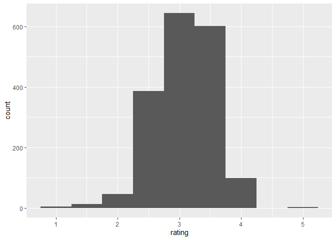
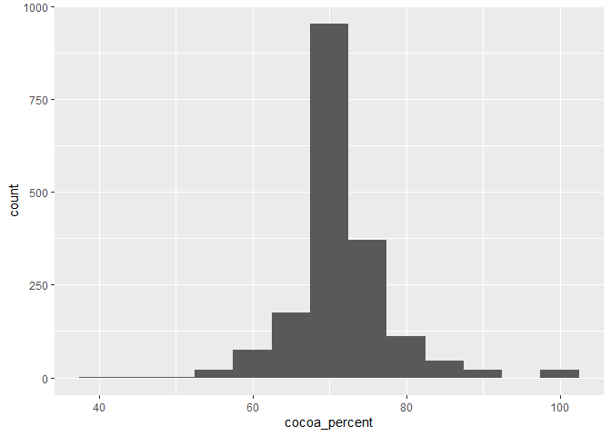
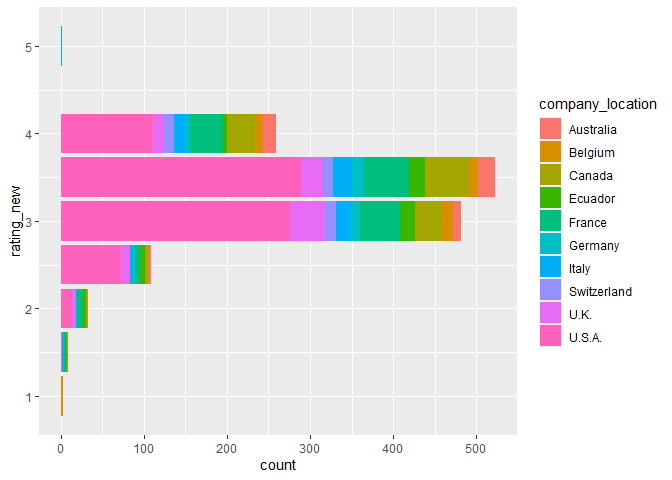
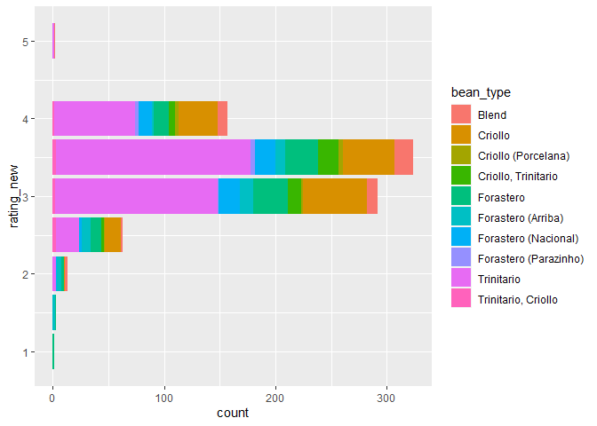
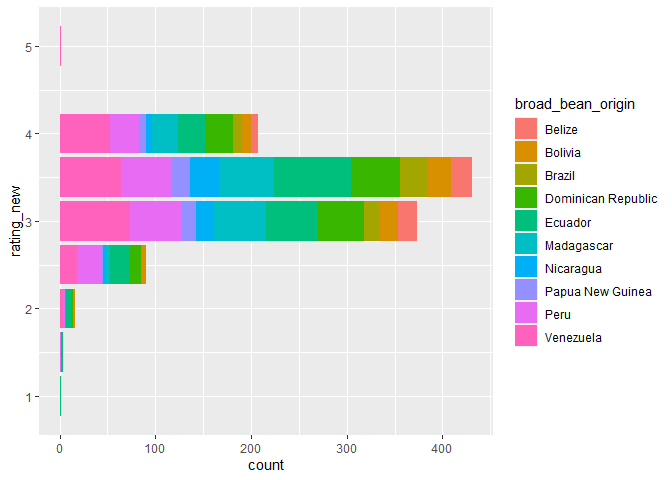

Chocolate Bar Rating
================
Fanyi Zeng
3/15/2022

The data comes from Flavors of Cacao by way of Georgios and Kelsey.
source:
<https://github.com/rfordatascience/tidytuesday/blob/master/data/2022/2022-01-18/readme.md>

``` r
library(tidyverse)
library(tidymodels)
library(broom)
cacao <- read_csv('flavors_of_cacao.csv')
```

To clean up the data, let’s replace the spaces from the variable names
with underscores so they are more manageable. Also, we should remove the
% signs in the cocoa percent so that we can analyze them as numeric
values.

``` r
names(cacao) <- tolower(gsub(pattern = '[[:space:]+]', '_', names(cacao)))
cacao$cocoa_percent <- sapply(cacao$cocoa_percent, function(x) gsub("%", "", x))
cacao <- type_convert(cacao)
```

Both the rating and the cocoa percent are normally distributed.

``` r
cacao %>%
  ggplot(aes(x=rating)) + 
  geom_histogram(binwidth=0.5)
```

<!-- -->

``` r
cacao %>%
  ggplot(aes(x=cocoa_percent)) + 
  geom_histogram(binwidth=5)
```

<!-- -->

The top 3 chocolate manufacturing countries are US, France, and Canada.
The top 3 known bean types are Trinitario, Criollo, and Forastero. The
top 5 bean origins are Venezuela, Ecuado, Peru, Madagascar, and
Dominican Republic, with the top 3 in South America, the fourth in
Africa, and the fifth in central America. This makes sense because US is
the largest manufacturer and they might import beans mainly from the
closest locations.

``` r
cacao %>%
  count(company_location) %>%
  arrange(desc(n))
```

    ## # A tibble: 60 x 2
    ##    company_location     n
    ##    <chr>            <int>
    ##  1 U.S.A.             764
    ##  2 France             156
    ##  3 Canada             125
    ##  4 U.K.                96
    ##  5 Italy               63
    ##  6 Ecuador             54
    ##  7 Australia           49
    ##  8 Belgium             40
    ##  9 Switzerland         38
    ## 10 Germany             35
    ## # ... with 50 more rows

``` r
cacao %>%
  count(bean_type) %>%
  arrange(desc(n))
```

    ## # A tibble: 42 x 2
    ##    bean_type                n
    ##    <chr>                <int>
    ##  1                        887
    ##  2 Trinitario             419
    ##  3 Criollo                153
    ##  4 Forastero               87
    ##  5 Forastero (Nacional)    52
    ##  6 Blend                   41
    ##  7 Criollo, Trinitario     39
    ##  8 Forastero (Arriba)      37
    ##  9 Criollo (Porcelana)     10
    ## 10 Trinitario, Criollo      9
    ## # ... with 32 more rows

``` r
cacao %>%
  count(broad_bean_origin) %>%
  arrange(desc(n))
```

    ## # A tibble: 101 x 2
    ##    broad_bean_origin      n
    ##    <chr>              <int>
    ##  1 Venezuela            214
    ##  2 Ecuador              193
    ##  3 Peru                 165
    ##  4 Madagascar           145
    ##  5 Dominican Republic   141
    ##  6                       73
    ##  7 Nicaragua             60
    ##  8 Brazil                58
    ##  9 Bolivia               57
    ## 10 Belize                49
    ## # ... with 91 more rows

Cocoa percent seems to be weakly, negatively correlated with rating,
such that lower cocoa percent tends to be more highly favored.

``` r
m_percent <- lm(rating ~ cocoa_percent, cacao)
summary(m_percent)
```

    ## 
    ## Call:
    ## lm(formula = rating ~ cocoa_percent, data = cacao)
    ## 
    ## Residuals:
    ##     Min      1Q  Median      3Q     Max 
    ## -2.2071 -0.3196  0.0429  0.3178  1.7929 
    ## 
    ## Coefficients:
    ##                Estimate Std. Error t value Pr(>|t|)    
    ## (Intercept)    4.079388   0.126757  32.183  < 2e-16 ***
    ## cocoa_percent -0.012461   0.001761  -7.076 2.12e-12 ***
    ## ---
    ## Signif. codes:  0 '***' 0.001 '**' 0.01 '*' 0.05 '.' 0.1 ' ' 1
    ## 
    ## Residual standard error: 0.4717 on 1793 degrees of freedom
    ## Multiple R-squared:  0.02717,    Adjusted R-squared:  0.02662 
    ## F-statistic: 50.07 on 1 and 1793 DF,  p-value: 2.122e-12

To compare across different ratings, I am going to convert rating into
categories: 1, 1.5, 2, 2.5, 3, 3.5, 4, 4.5, and 5.

``` r
cacao <- cacao %>%
  mutate(rating_new = case_when(
         rating <= 0.5 ~ 0.5,
         rating > 0.5 & rating <= 1 ~ 1,
         rating > 1 & rating <= 1.5 ~ 1.5,
         rating > 1.5 & rating <= 2 ~ 2,
         rating > 2 & rating <= 2.5 ~ 2.5,
         rating > 2.5 & rating <= 3 ~ 3,
         rating > 3 & rating <= 3.5 ~ 3.5,
         rating > 3.5 & rating <= 4 ~ 4,
         rating > 4 & rating <= 4.5 ~ 4.5,
         rating > 4.5 & rating <= 5 ~ 5
         ))
```

Then, let’s break down rating distribution by company location. Since
there are a lot of locations, I only filter for the top 10 company
locations. Apparently, US is the largest chocolate manufacturer.
However, speaking of chocolate flavor, Italy seems to have the best
chocolate in the world, even though it has relatively smaller market
share. Interestingly, Belgium not only has good chocolate, but also has
poorly rated ones.

``` r
cacao %>%
  filter(company_location=="U.S.A."|company_location=="U.K."|company_location=="Italy"|company_location=="Canada"|company_location== "France" |company_location== "Ecuador"|company_location== "Australia"|company_location== "Germany"|company_location== "Belgium"|company_location== "Switzerland") %>%
  ggplot(aes(y=rating_new, fill=company_location)) +
  geom_bar()
```

<!-- -->

Now, let’s break down rating distribution by bean type. Again, Top 10
(known) bean types are selected. It seems one brand of Trinitario has
the best rating and one brand of Forastero the worst.

``` r
cacao %>%
  filter(bean_type == "Trinitario"|bean_type == "Criollo"|bean_type == "Forastero"|bean_type == "Forastero (Nacional)"|bean_type == "Blend"|bean_type == "Criollo, Trinitario"|bean_type == "Forastero (Arriba)"|bean_type == "Criollo (Porcelana)"|bean_type == "Trinitario, Criollo"|bean_type == "Forastero (Parazinho)") %>%
  ggplot(aes(y=rating_new, fill=bean_type)) +
  geom_bar()
```

<!-- -->

Next, we can break down rating distribution by broad bean origin. Top 10
are selected. One brand of Venezuela’s originated chocolate is the best
rated, and one brand of Ecuador’s originated chocolate is the worst
rated.

``` r
cacao %>%
  filter(broad_bean_origin=="Venezuela"|broad_bean_origin=="Ecuador"|broad_bean_origin=="Peru"|broad_bean_origin=="Madagascar"|broad_bean_origin=="Dominican Republic"|broad_bean_origin=="Nicaragua"|broad_bean_origin=="Brazil"|broad_bean_origin=="Bolivia"|broad_bean_origin=="Belize"|broad_bean_origin=="Papua New Guinea") %>%
  ggplot(aes(y=rating_new, fill=broad_bean_origin)) +
  geom_bar()
```

<!-- -->

These distributions make me wonder what specific chocolate brands are in
categories 0.5-1 and categories 4.5-5. Let’s filter out those chocolate
bars.

Three Beligum branded and one Sao Tome (an African island nation)
branded chocolate bars have the lowest ratings.

The two best chocolate bars are from the Italian brand, Amedei. It is an
artisan chocolate company in the Tuscany region of Italy and is
considered among the finest chocolate manufacturers in the world. Fun
fact, they only have 33 employees in the company.

I would love to try their chocolates!

``` r
cacao %>%
  filter(rating_new==1|rating_new==0.5)
```

    ## # A tibble: 4 x 10
    ##   `company _(maker-if_known)` specific_bean_ori~   ref review_date cocoa_percent
    ##   <chr>                       <chr>              <dbl>       <dbl>         <dbl>
    ## 1 Callebaut                   Baking               141        2007            70
    ## 2 Claudio Corallo             Principe             252        2008           100
    ## 3 Cote d' Or (Kraft)          Sensations Intense    48        2006            70
    ## 4 Neuhaus (Callebaut)         Dark                 135        2007            73
    ## # ... with 5 more variables: company_location <chr>, rating <dbl>,
    ## #   bean_type <chr>, broad_bean_origin <chr>, rating_new <dbl>

``` r
cacao %>%
  filter(rating_new==5|rating_new==4.5)
```

    ## # A tibble: 2 x 10
    ##   `company _(maker-if_known)` specific_bean_ori~   ref review_date cocoa_percent
    ##   <chr>                       <chr>              <dbl>       <dbl>         <dbl>
    ## 1 Amedei                      Chuao                111        2007            70
    ## 2 Amedei                      Toscano Black         40        2006            70
    ## # ... with 5 more variables: company_location <chr>, rating <dbl>,
    ## #   bean_type <chr>, broad_bean_origin <chr>, rating_new <dbl>
